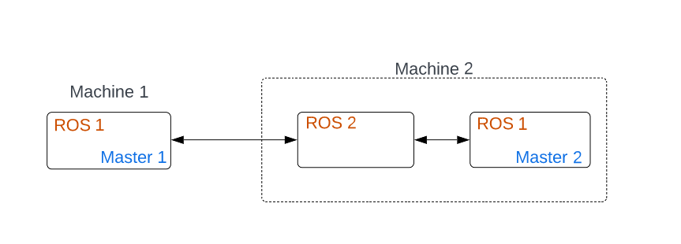

# Communication Multimachine


En robotique il est souvent nécessaire d'avoir plusieurs machines qui communiquent entre elles. Dans notre cas nous avons un robot mobile qui doit communiquer avec une console déportée

Il existe plusieurs façons de communiquer entre machines avec ROS

Nous allons décrire quelqu'une de ces méthodes en présentant leurs avantages et inconvénients

Dans toutes ces méthodes des machines partage le même réseau.
Pour que deux machines puissent communiquer correctement, il est important,
dans ==/etc/hosts==,  d'ajouter la ligne suivante:

#### Au niveau de la machine1

    [IP machinne 1]    [Nom machinne 1]

exemple:

    192.168.1.4     robot


#### Au niveau de la machine2 

    [IP machinne 2]    [Nom machinne 2]

exemple:

    192.168.1.5     console


## 1. Utilisation d'une machine "maître"

La méthode la plus simple et d'utiliser un master unique partagé par plusieurs machines.


Nous avons une machine "maître" qui partage son master avec des machines "escalves".

#### Commande:

Au niveau de la machine maître, dans un terminal:

    export ROS_HOSTNAME={IP MAITRE}
    export ROS_MASTER_URI=http://{IP MAITRE}:11311


Au niveau de la machine esclave, dans un terminal:


    export ROS_HOSTNAME={IP ESCLAVE}
    export ROS_MASTER_URI=http://{IP MAITRE}:11311


#### Exemple:

Prenons un exemple, nous avons deux machine, un robot et une console, d'adresse IP respective suivante :
192.168.1.1 et 192.168.1.2 


Ici, on utilise le master de la console.

Au niveau de la console, dans un terminal:

    export ROS_HOSTNAME=192.168.1.1
    export ROS_MASTER_URI=http://192.168.1.1:11311


Au niveau du robot, dans un terminal:


    export ROS_HOSTNAME=192.168.1.2
    export ROS_MASTER_URI=http://192.168.1.1:11311


Ainsi les deux machines partage le même master et peuvent donc echanger des topics.


### Avantage

Cette méthode et simple et rapide à mettre en place.


### Inconveniants

Le problème est l'ulisation d'un master unique. En effet si une machine "esclave" pert la connection avec la machine "maître" alors elle pert le master et ne peut donc plus utiliser les nodes ROS. Dans notre cas si le robot s'eloigne de notre console est se deconnecte alors il ne pourra plus utiliser ROS.


## 2. Utilisation de la classe c++ ros::master

Cette méthode plus compliqué mais elle permet d'utiliser plusieurs master.
Pour cela une machine se connecte au master d'une machine "cible" souscrit a un topic et publie une copie de ce même topic dans son environement local (master local)

Il existe une methode de la classe ros,  ``` ros::master::init() ```  qui peremt de se connecte à un autre master dans le même reseau.

Attention, pour utiliser cette méthode il important d'ajouter au niveau de chaque machine dans ```/etc/hosts ``` les adresses IP des autres machines

####  Exemple de code :

dans le code suivant une console se connecte au master d'un robot, souscirt a son topic SCAN et publie une copie de ce topic dans son environnement local.

```cpp


int main(int argc, char **argv)
{
    // On initialse notre node scan_copieur dans l'environnement local
    ros::init(argc,argv,"scan_copieur");
    ros::NodeHandle nh;


    // on créer un objet de notre classe PublisherLocal, on appel ainsi le constructeur qui créé un publisher local
    PublisherLocal PublisherLocal;


 
    //On declare les deux environemments
    std::string robot_master = "http://192.168.1.4::11311";
    std::string console_master= "http://192.168.1.5::11311";

    //On crée une varibale map M_string et on insere à l'index __master le master auquel on veux se connecter
    ros::M_string remappings; 
    remappings["__master"] = robot_master;

    //On se connecte au master souhaité
    ros::master::init(remappings);

    //On souscrit au topic Scan, ici on souscrit dans l'environnement du robot_master
    ros::Subscriber subscriberFeedback = nh.subscribe("/scan", 1000, &PublisherLocal::callback, &hostTopic);  

    [....]

}

class PublisherLocal{

    public:
        PublisherLocal();
        ~PublisherLocal();
        void callback(const sensor_msgs::LaserScan msg);    
        ros::Publisher pub;
      

    private:
        ros::NodeHandle n;

};


PublisherLocal::PublisherLocal() {
    pub = n.advertise<sensor_msgs::LaserScan>("/scan", 1000);
}

PublisherLocal::~PublisherLocal(){}


void PublisherLocal::callback(const sensor_msgs::LaserScan msg){ 

    if(ok == 1){
        oldSeq = msg.header.seq;
        ok = 0;
    }
    else{
        newSeq = msg.header.seq;
        ok = 1;
    }

    if(newSeq > oldSeq)
            pub.publish(msg);
    

}


``` 

Voir code complet -> [lien git hub]

### Avantage

Cette méthode permet d'avoir plus de contrôles sur la connexion entre machines, elle rend la communication plus flexible.
Chaque machine garde son propre master et peut donc être indépendante de la connexion réseau.

### Inconveniants

La méthode est plus complexe et est unidirectionnelle, en effet dans l'exemple présenté précédemment, il s'agit d'une lecture et recopie mais pas d'un réel échange de topic.

Si plusieurs topics doivent être échangés, il devient fastidieux de réaliser une recopie pour chaque topic.

## 3. Utilisation de ROS Bridge

Dans l'exemple suivant nous allons utilisé ROS2. L'avantage de ROS2 est que la communication se fait sans Master. Nous allons utliser ROS 2 pour transferer les topic d'une machine ROS1 à une autre machine ROS1




#### Au niveau de la machine 1

    export ROS_MASTER_URI=http://192.168.1.4:11311
    export ROS_HOSTNAME=192.168.1.4


#### Au niveau de la machine 2

Premier terminal

    export ROS_MASTER_URI=http://192.168.1.4:11311
    source ROS1
    source ROS2
    ros2 run ros1_bridge dynamic_bridge --bridge-all-topics

Deuxième terminal

    source ROS1
    source ROS2
    ros2 run ros1_bridge dynamic_bridge --bridge-all-topics


Ce script .sh permet d'automatiser la connection


```sh
export ROS_MASTER_URI=http://192.168.1.4:11311
source ${ROS1}
source ${ROS2}

gnome-terminal --tab --command="ros2 run ros1_bridge dynamic_bridge --bridge-all-topics"


export ROS_MASTER_URI=http://localhost:11311

source ${ROS1}
source ${ROS2}

gnome-terminal --tab --command="ros2 run ros1_bridge dynamic_bridge --bridge-all-topics"


source ${ROS1}
source devel/setup.bash
roslaunch nodes starting_launch.launch #lancement d'un node dans ROS1 local
```


