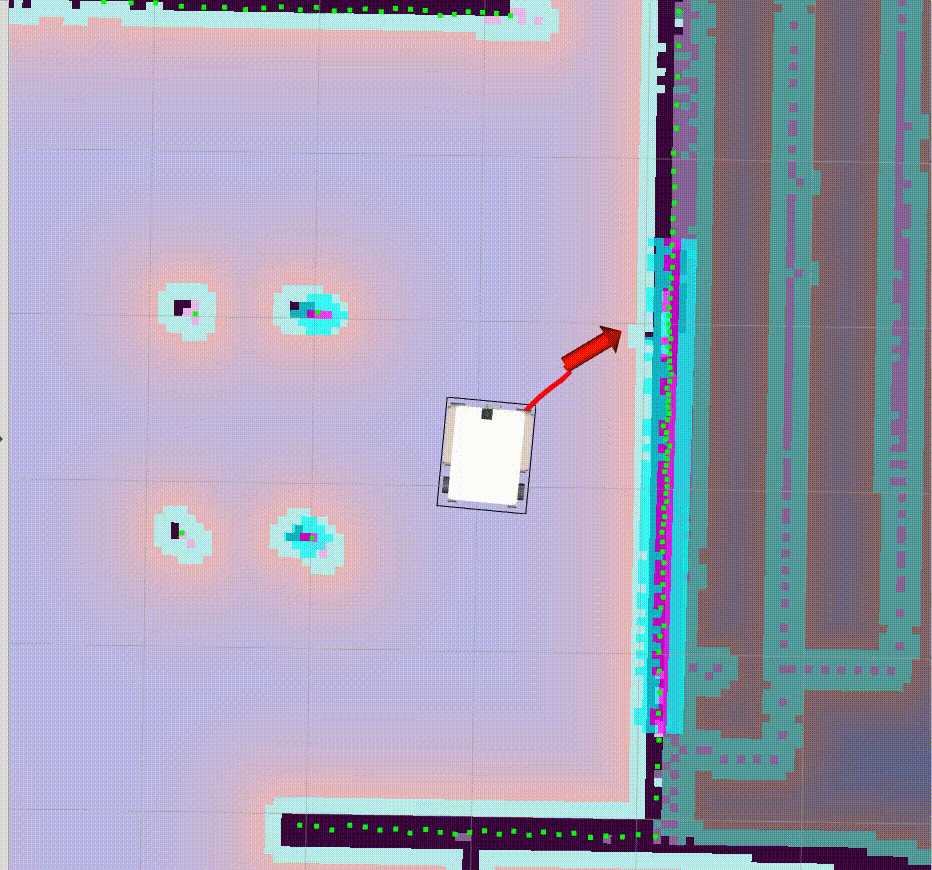
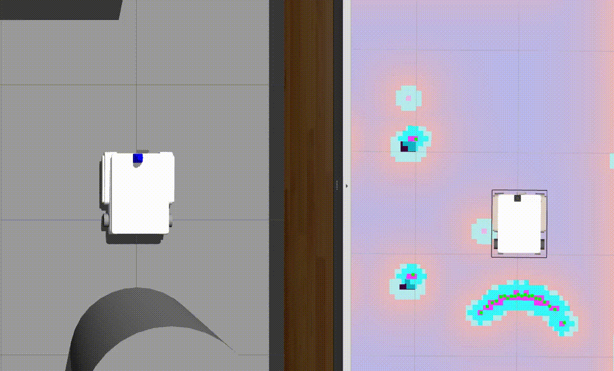

# Recovery


dans **move_base_flex_recovery.yaml** nous ajoutons les plugins que l'on shoaie utiliser

``` yaml

planners:
  - name: navfn/NavfnROS
    type: navfn/NavfnROS
  - name: global_planner/GlobalPlanner
    type: global_planner/GlobalPlanner

controllers:

  - name: dwa_local_planner/DWAPlannerROS
    type: dwa_local_planner/DWAPlannerROS

  #- name: eband_local_planner/EBandPlannerROS
  #  type: eband_local_planner/EBandPlannerROS
  # - name: teb_local_planner/TebLocalPlannerROS
 #   type: teb_local_planner/TebLocalPlannerROS


recovery_behaviors:

  - name: 'rotate_recovery/RotateRecovery'
    type: 'rotate_recovery/RotateRecovery'
  - name: clear_costmap_recovery
    type: clear_costmap_recovery/ClearCostmapRecovery
  - name: 'moveback_recovery'
    type: 'moveback_recovery/MoveBackRecovery'


moveback_recovery:
  linear_vel_back: -0.4 # default -0.3
  step_back_length: 0.3  # default 1.0
  step_back_timeout: 5.0 # default 15.0


controller_frequency: 5.0
controller_patience: 10.0
controller_max_retries: 10

planner_frequency: 1
planner_patience: 10.0
planner_max_retries: 10

recovery_enabled: true
recovery_patience: 15.0

oscillation_timeout: 10.0
oscillation_distance: 0.2


```

# Rotate Recovery


Le plugin  ``` rotate_recovery/RotateRecovery``` est un plugin custum -> [Créer son propre plugin](Recovery_Plugin.md)
qui met en roation le robot et s'arreter lorsqu'il est aligné avec la trajectoire





Lors d'une rotation le robot s'arrette si il detecte un obstacle et revoi le code  159  [CANT_TURN]


# Move Back Recovery

Ce Recovery fait reculer le robot a une distance et avec une vitesse definit


Le robot s'arrette si il detecte un obstacle et revoi le code  150  [FAILURE]





