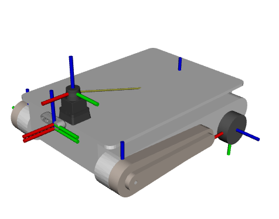

# TF statique


Notre robot est composé de différente corps ( flipper, roues, lidar ...) qui disposent chaqun de leur propre coordonées. Pour visualiser notre robot dans l'espace il est necessaire de relier ces coorodnées entre elles par le biai de transformation (TF).

Dans notre cas, les différents corps sont fixes les un des autres. Pour les relier on parle alors de TF statique.
Pour réaliser un TF statique nous pouvons utiliser le node **robot_state_publisher** et **joint_state_publisher** qui vont lire l'urdf de notre modèle et creer les TF entre les different joints.

## Launch file

``` xml
<launch>
  <arg name="model" default="$(find rescue_description)/urdf/rescue.xacro"/>
  <arg name="gui" default="true"/>
  <arg name="rvizconfig" default="$(find rescue_description)/launch/urdf.rviz"/>
  <param name="robot_description" command="$(find xacro)/xacro $(arg model)"/>
  <param name="use_gui" value="$(arg gui)"/>
  <node name="joint_state_publisher" pkg="joint_state_publisher" type="joint_state_publisher"/>
  <node name="robot_state_publisher" pkg="robot_state_publisher" type="robot_state_publisher"/>
  <node name="rviz" pkg="rviz" args="-d $(arg rvizconfig)" type="rviz" required="true"/>
</launch>
```

Lancement du launch file:

    roslaunch rescue_description display.launch 





